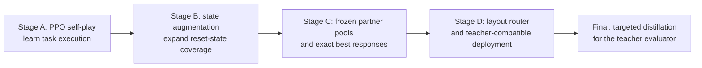
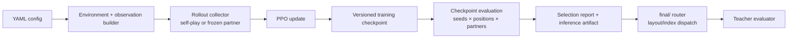

# Overcook: cooperative PPO agents for Overcooked-AI

`Overcook` is an experiment system for cooperative Overcooked-AI agents. It
starts with self-play PPO, adds state and partner-distribution robustness
experiments, and finishes with a teacher-compatible router for four disclosed
competition layouts. The emphasis is on reproducible experiment design,
evaluation, and deployment decisions—not on claiming a novel RL algorithm.

> **Status:** stable submission bundle in [`final/`](final/); experimental
> research pipeline in `src/`, `configs/`, and `scripts/`; historical local
> artifacts remain under ignored `outputs/`.

## Why this problem is difficult

Overcooked is cooperative, partially coupled control: one policy's navigation,
ingredient, pot, and delivery decisions alter the other policy's useful action
space. A strong self-play policy can therefore learn a narrow coordination
convention that fails with a different scripted, sticky, random, or learned
partner. This project tests that failure mode explicitly through both physical
player positions, fixed seeds, frozen partners, and zero-soup diagnostics.

## Experimental process



The PPO experiments followed a fixed loop: formulate a partner/state-coverage
hypothesis, commit a YAML configuration, run a local parse/import smoke, train
with saved checkpoints, evaluate every candidate on a fixed suite, and record
the selection rationale. Stage B/C were motivated by the project research
premise that self-play competence alone is brittle under partner and
state-distribution shift, while broader valid-state coverage and partner
diversity can improve cross-play robustness.

The final deployment is intentionally a separate phase. Once the course
evaluator exposed recipe-validity failures in the historical benchmark, the
project retained the original PPO artifacts and added short dataset-aggregation
distillation only inside `final/`. It adapts validated specialist behavior to
the course evaluator; it is not presented as a replacement for, or proof of an
improved, PPO training objective. See
[`docs/EXPERIMENT_HISTORY.md`](docs/EXPERIMENT_HISTORY.md) for the full
experimental sequence and [`docs/RESULTS.md`](docs/RESULTS.md) for both result
families.

## PPO research benchmark

The original PPO checkpoints are retained under ignored `outputs/` and are
evaluated by the repository's checkpoint suite. They document the research
process—self-play competence, exact-partner continuations, and positional
robustness—not the final course benchmark. The retained selected artifacts are:

| Layout | Selected PPO artifact | Internal benchmark protocol | Mean score | Mean soups | Source |
| --- | --- | --- | ---: | ---: | --- |
| `asymmetric_advantages` | step 900,096 Stage A inference | 3 seeds × both positions vs `greedy_full_task` | 65,273.00 | not valid under final recipe rule | `outputs/stage_a_asymmetric_seed67/selected/scenario1_evaluation.json` |
| `coordination_ring` | seed-2 self-play inference | 3 seeds × both positions, deterministic self-play | 13,817.00 | 1.00 per position | `outputs/baseline_coordination_ring_seed2_1m/checkpoint_evaluation/checkpoint_evaluation.json` |
| `counter_circuit` | seed-3 exact-partner step 1,902,592 | 20 seeds × both positions vs disclosed sticky/random greedy | 42,380.08 | 4.15 | `outputs/counter_circuit_exact_long_seed3_1m/checkpoint_evaluation/checkpoint_evaluation.json` |

These reports use the internal checkpoint protocol described in
[`docs/EVALUATION_PROTOCOL.md`](docs/EVALUATION_PROTOCOL.md). During later
debugging, the team found that the historical delivery ledger could count an
interaction that did **not** receive sparse reward for the active recipe. The
artifacts are preserved for the PPO record, but those scores are deliberately
not relabeled as course-evaluation scores.

## Course-evaluation adaptation and verified final benchmark

To satisfy the course evaluator without changing the original PPO research
artifacts, `final/` uses short dataset aggregation from validated
layout-specific teachers. The teacher actions label learner-visited states; the
result is a compact actor with the same teacher-facing action contract. This
was used only for the self-contained submission bundle. Scenario 2 retains the
guided PPO model because the forced cross-layout comparison did not justify
routing it elsewhere.

The table below is the canonical course result table. It uses the unchanged
evaluator bundled in `final/`, the official four seeds (`67`, `607`, `6007`,
`60007`), and only positive-reward soups. It should not be compared directly
with the internal PPO benchmark above.

| Scenario / layout | Ego index | Partner | Route | Seeds | Mean score | Mean soups | Evidence |
| --- | ---: | --- | --- | ---: | ---: | ---: | --- |
| 1 / `asymmetric_advantages` | 0 | `greedy_full_task` | distilled PPO-compatible actor | 4 | 140,420.00 | 14.00 | [`final/README_STUDENT_AGENT.md`](final/README_STUDENT_AGENT.md) |
| 2 / `coordination_ring` | 0 | sticky `greedy_full_task` (0.10) | guided PPO teammate model | 4 | 54,358.50 | 5.25 | [`final/README_STUDENT_AGENT.md`](final/README_STUDENT_AGENT.md) |
| 3 / `counter_circuit` | 0 | sticky/random `greedy_full_task` (0.15 / 0.05) | distilled mixed-recipe actor | 4 | 76,296.75 | 7.50 | [`final/README_STUDENT_AGENT.md`](final/README_STUDENT_AGENT.md) |
| 4 / custom `scenario_4` | 0 | noisy `random_motion` | distilled fixed-pot-B actor | 4 | 95,526.50 | 9.50 | [`final/README_STUDENT_AGENT.md`](final/README_STUDENT_AGENT.md) |
| 4 / custom `scenario_4` | 1 | noisy `random_motion` | distilled fixed-pot-B actor | 4 | 93,100.25 | 9.25 | [`final/README_STUDENT_AGENT.md`](final/README_STUDENT_AGENT.md) |

Scenario 4's eight position/seed attempts average `94,313.38` score and
`9.375` soups. The equal-weight mean across the four scenarios is `91,347.16`.
See [`docs/RESULTS.md`](docs/RESULTS.md) for protocol boundaries and historical
results that are intentionally excluded from this table.

## Quick start

Python 3.10–3.12 is supported. The project pins Overcooked-AI 1.1.0, NumPy
below 2, and PyTorch. Install the repository-local environment:

```bash
uv sync
.venv/bin/pytest -q
```

### Run the self-contained submission benchmark

Run from `final/`; this is the same router and assets intended for teacher
evaluation:

```bash
cd final
../.venv/bin/python -m src.evaluate_competition \
  --config configs/competition.yaml --all-scenarios
```

For one scenario or rendering:

```bash
cd final
../.venv/bin/python -m src.evaluate_competition \
  --config configs/competition.yaml --scenario 1

../.venv/bin/python -m src.evaluate_competition \
  --config configs/competition.yaml --scenario 1 --render
```

`final/configs/competition.yaml` must keep its `submissions` entry pointed at
`policies/template.py` and `StudentAgent`; replacing it with the teacher
template bypasses the router. A clone includes the active model weights and all
runtime code under `final/`; no Kaggle, RunPod, or parent-output dependency is
needed for this benchmark.

### Minimal research-pipeline smoke

The non-submission pipeline remains reproducible through YAML:

```bash
.venv/bin/python scripts/train.py \
  --config configs/examples/ppo_smoke.yaml

.venv/bin/python scripts/train.py \
  --config configs/stage_a/ablation_baseline_200k.yaml \
  --evaluate-checkpoints
```

The smoke creates a small run directory; the second command creates a full
checkpoint-evaluation run containing an effective
configuration, metrics JSONL, training checkpoints, exported inference
artifacts, and a checkpoint-evaluation report. Use the short examples in
[`docs/REPRODUCIBILITY.md`](docs/REPRODUCIBILITY.md) before launching a large
run.

## System overview



The architecture and stable interfaces are described in
[`docs/architecture.md`](docs/architecture.md). Research questions, decisions,
and known limitations are linked below.

## Documentation

| Document | Purpose |
| --- | --- |
| [`docs/RESEARCH_QUESTIONS.md`](docs/RESEARCH_QUESTIONS.md) | hypotheses and paper-informed rationale |
| [`docs/EXPERIMENT_HISTORY.md`](docs/EXPERIMENT_HISTORY.md) | concise decision log by stage |
| [`docs/RESULTS.md`](docs/RESULTS.md) | verified, protocol-separated results |
| [`docs/EVALUATION_PROTOCOL.md`](docs/EVALUATION_PROTOCOL.md) | score, seeds, positions, and selection rules |
| [`docs/FAILURE_ANALYSIS.md`](docs/FAILURE_ANALYSIS.md) | invalid-delivery and routing failures |
| [`docs/REPRODUCIBILITY.md`](docs/REPRODUCIBILITY.md) | local, Kaggle, and RunPod workflows |
| [`final/README_STUDENT_AGENT.md`](final/README_STUDENT_AGENT.md) | self-contained submission-bundle details |

Detailed implementation references remain in
[`docs/stage_b_state_augmentation.md`](docs/stage_b_state_augmentation.md),
[`docs/stage_c_partners.md`](docs/stage_c_partners.md),
[`docs/kaggle_workflow.md`](docs/kaggle_workflow.md), and
[`docs/workstreams/`](docs/workstreams/). They are technical/historical
references rather than the top-level project narrative.

## Model and artifact policy

- **`final/` — stable deployment bundle.** It contains the distilled
  Scenario 1, 3, and 4 actors, the Scenario 2 guided PPO model, router, layouts,
  and teacher evaluator needed by a fresh clone.
- **`outputs/` — local research history.** It is intentionally ignored because
  it contains large checkpoints and logs. The pre-distillation selected PPO
  artifacts remain there unchanged; their paths and hashes are documented in
  [`docs/RESULTS.md`](docs/RESULTS.md). They are not silently overwritten by
  final-bundle distillation.
- **Kaggle/RunPod — execution backends, not runtime dependencies.** Remote jobs
  package an immutable source/configuration and download accepted outputs back
  to `outputs/`.

## Scope and limitations

The final router specializes known layouts. It is not a claim of broad
generalization to arbitrary layouts or partners. Historical checkpoint reports
that relied on a recipe-agnostic delivery ledger are retained as diagnostic
evidence, but are not advertised as teacher-benchmark results. The project did
not create the Overcooked environment or PPO; it integrates and evaluates them
in a reproducible task-specific system.
